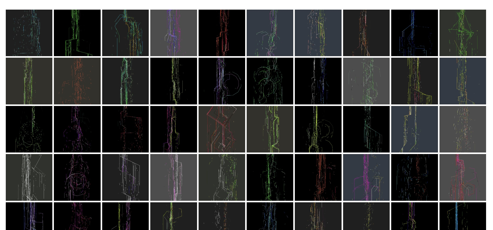

# Token Utils

Node.js scripts to get blockchain NFT token data and thumbnail images from an artist wallet. Currently, it supports fxhash and objkt platforms using their GraphQL APIs.

I used the script to download all the token data (thumbnail images, ipfs URL to link to a generative artwork, etc.) for [my website](https://paperdove.com/knowledge/). My work is either generative or video, so the script hasn't been tested for other types of work.

At the current state, it doesn't download the original artworks (ex. mp4 video or hi-res images) because I haven't found a need yet, but the code can be customized.



## How to use

1. `npm i`
1. `npm run build`
1. `./dist/index.js --help`

## Objkt

Use `-p objkt` for the platform, add `-ca "tz1.."` for a creator wallet address and add the contract name like `-c "Versum Items"`. Objkt can fetch data from all tezos platform.

Examples:

```sh
node ./dist/index.js --platform objkt --creator-address "tz1ABCD..." --contract "Versum Items" --data --images

# I've noticed the thumbnails are missing from my hic et nunc contract so just download JSON.
node ./dist/index.js -p objkt -ca "tz1ABCD..." -c "hic et nunc" --data
```

## fxhash

Get the ID (ex. `--id 26066`) from each project URL from the fxhash website. Optionally, pass `-s` and `-e` to set the range to download the images from. It starts at `1`. This is useful if you lose the network connection and need to continue download images. No need to provide the creator address.

Objkt API provides access to all Tezos tokens, so it can handle fxhash data as well. But for now, fxhash data comes from the fxhash API.

Examples:

```sh
# download JSON data only
node ./dist/index.js -p fxhash --id 26066 --data

# download token data and images from 69 to 70 (inclusive)
node ./dist/index.js -p fxhash --id 26066 --data --images -s 69 -e 70
```

## To dos

- [ ] fxhash input with `--slug`.
- [ ] ability to download the original work in case of video or images.
- [ ] make it work for collected token data of a wallet.
- [ ] get token data from Solana.

## License

MIT
